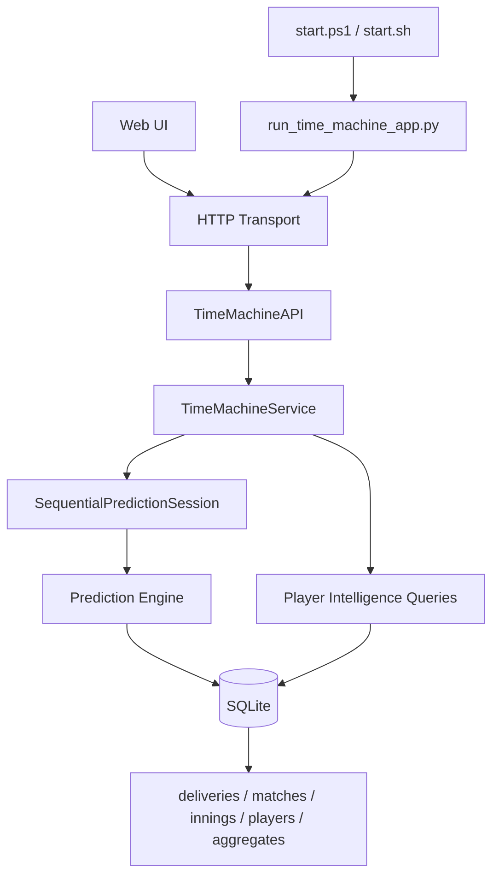
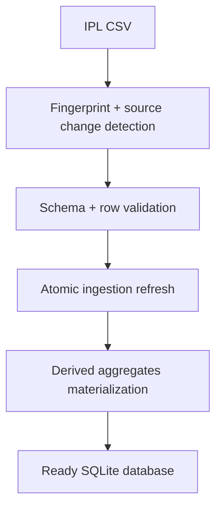
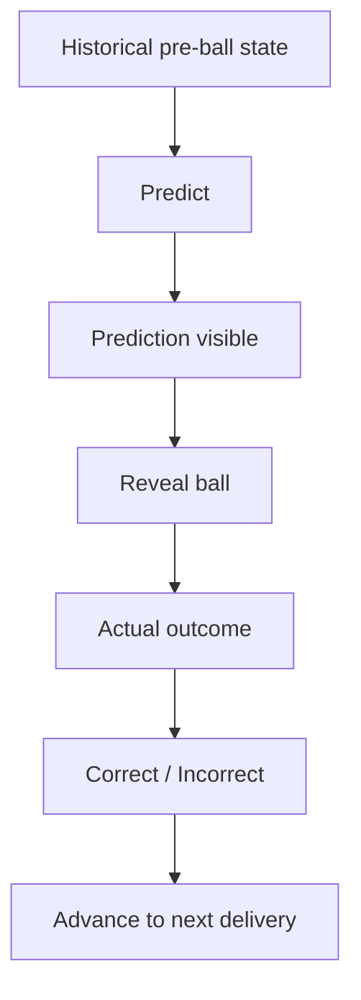

# MatchGenomeIPL

MatchGenomeIPL is an IPL historical prediction product where you can travel to a real past delivery, see what the model would have predicted **before the ball**, reveal reality, and measure correctness.

## Product

MatchGenomeIPL combines:

- a deterministic next-ball prediction engine,
- strict chronology-safe replay,
- evidence and reliability reporting,
- and connected Time Machine plus Player Intelligence experiences over real IPL data.

## Problem It Solves

Most cricket tools explain what already happened. MatchGenomeIPL answers a different question:

> At this exact historical point, what would the model predict next, and was it right?

## Differentiator

Prediction is shown before reveal, then reality is revealed and scored. This prediction-vs-reality loop is the product center, not an afterthought.

## Implemented Capabilities

- Real IPL dataset support (`2008-2026`, `288,226` deliveries).
- DB-first runtime using SQLite (`data/ipl.sqlite3`).
- Source-aware ingestion with fingerprinting and unchanged-source skip.
- Pre-delivery match-state reconstruction.
- Deterministic hierarchical baseline prediction with evidence and reliability.
- Deterministic contextual prediction model with pre-ball player history, matchup context, and innings-pressure adjustments.
- Prediction-difference diagnostics showing what changed between consecutive deliveries.
- Time Machine session lifecycle (`predict -> reveal -> update`).
- HTTP API transport and browser UI.
- Ask MatchGenome natural-language querying over local SQLite with structured query planning and read-only SQL execution.
- Player Intelligence profiles with role-aware sections, season/phase splits, matchup reliability, and replay return links.
- Lightweight player discovery search backed directly by SQLite.

## Current vs Future Scope

- Implemented now: prediction/reveal replay, player intelligence, logging, startup scripts, benchmarks, tests.
- Not implemented yet: persistent replay sessions across process restarts, rich random seek UI, broad photo library coverage.

## System Architecture



## Data Ingestion Flow



## Prediction Lifecycle Flow



## Product Navigation Flow

```text
MatchGenomeIPL
  -> Home (launch narrative + entry points)
  -> Time Machine (predict before reveal)
  -> Discover via season + match cards (human-readable identities)
  -> Click batter / non-striker / bowler
  -> Players workspace (search-first, context-aware intelligence)
  -> Return to Time Machine (same replay context)
  -> Methodology (plain-language model + data contract)
```

## Time Machine Workspace

The Time Machine UI is organized as a focused workspace:

- discovery: season selector, match search, human-readable match cards, innings picker,
- replay header: teams, season/match identity, innings, score, delivery progress, prediction accuracy,
- replay tabs: `Prediction`, `Ball-by-Ball`, `Evidence`,
- prediction-first storytelling: pre-ball context -> model prediction -> reveal -> correctness.

Technical evidence is available through progressive disclosure in the `Evidence` tab.

## Enrichment Layer

Delivery truth remains the original IPL CSV in SQLite. Identity metadata is enriched separately and persisted for offline runtime.

- Source: Cricsheet IPL JSON archive (`https://cricsheet.org/downloads/ipl_json.zip`).
- Persisted tables: `enrichment_source`, `enrichment_run`, `team_identity`, `team_alias`, `match_metadata`, `match_team_map`, `player_asset`.
- Runtime behavior: if enrichment exists, app runs fully offline; enrichment refresh is explicit.
- Fallback behavior: unresolved mappings continue to display raw internal IDs.

Run enrichment manually:

```powershell
python scripts/run_enrichment.py
```

## Runtime Flow (Startup)

1. Resolve repository root and runtime paths.
2. Open SQLite DB.
3. Run `ensure_dataset_ready` against `data/ipl_ball_by_ball_data.csv`.
4. If source unchanged, ingestion is skipped.
5. Start HTTP server and serve UI/API.

## Database Notes

Important runtime tables:

- `deliveries`: validated ball-by-ball canonical table.
- `matches`, `innings_summary`, `players`, `teams`, `seasons`: discovery and context.
- `batter_stats_agg`, `bowler_stats_agg`, matchup aggregate tables: fast intelligence lookup.
- `ingestion_runs`, `data_sources`, `ingestion_state`: source/change tracking and readiness.

## Logging

Structured logs are emitted in the same terminal.

- Startup: environment, DB path/status, ingestion result, URL, startup duration.
- HTTP: method, route, status, duration.
- SQL (optional): query + params + row count + duration.

Configuration:

- `MATCHGENOME_LOG_LEVEL=INFO|DEBUG|WARN|ERROR`
- `MATCHGENOME_SQL_LOG=1` to enable SQL logging

Example output:

```text
[STARTUP] MatchGenomeIPL Time Machine
[DATA] Source unchanged - ingestion skipped
[SERVER] HTTP transport ready | url=http://127.0.0.1:8080
[HTTP] GET /api/seasons -> 200 | duration_ms=53.05
[HTTP] POST /api/replays/.../predict -> 200 | duration_ms=647.04
```

Secrets are not logged; runtime does not emit credential values.

## Startup

### Windows

```powershell
.\start.ps1
```

### Linux/macOS

```bash
chmod +x start.sh
./start.sh
```

### Direct runner (alternative)

```powershell
python scripts/run_time_machine_app.py
```

Open `http://127.0.0.1:8080`.

## API Surface (Current)

- `GET /api/seasons`
- `GET /api/seasons/{season_id}/matches`
- `GET /api/matches/{match_id}`
- `GET /api/matches/{match_id}/innings`
- `POST /api/replays`
- `GET /api/replays/{session_id}`
- `POST /api/replays/{session_id}/predict`
- `POST /api/replays/{session_id}/reveal`
- `POST /api/replays/{session_id}/restart`
- `GET /api/replays/{session_id}/ledger`
- `GET /api/replays/{session_id}/summary`
- `GET /api/players`
- `GET /api/players/{player_name}`
- `POST /api/ask`

Ask API notes:

- Input payload: `{ "question": "How many sixes did MS Dhoni hit in 2014?" }`
- Compound questions are split into sub-questions and answered independently.
- Unsupported sub-questions are reported explicitly; no fabricated answer is returned.
- Query execution is read-only and allowlisted.

Player API notes:

- `GET /api/players?query=<partial>&limit=<n>` supports case-insensitive partial matching.
- `GET /api/players/{player_name}?session_id=<replay_id>` includes optional replay entry-point metadata.

## Player Intelligence

Player metrics are derived from SQLite (no fabricated data), including:

- overview: matches, batting and bowling core metrics,
- batting/bowling season and phase splits,
- outcome distributions,
- matchup evidence with sample-size thresholds.

UI organization:

- search-first player discovery (no giant default player list),
- player identity header (name, role label, context, image provenance),
- tabbed sections: `Overview`, `Batting`, `Bowling`, `Matchups`, `Seasons`, `Phases`,
- role-aware visibility (batting/bowling sections shown only when relevant).

Metric definitions:

- batting balls faced: deliveries where `is_wide_ball = 0`.
- bowling runs conceded: `total_runs - bye_runs - leg_bye_runs`.
- bowling wickets: excludes non-bowler dismissal kinds defined in constants.
- innings phase: computed from legal balls before delivery (`powerplay < 36`, `middle < 90`, else `death`).
- outcome labels: `0`, `1`, `2`, `3+`, `4`, `6`, `wicket`.

### Player Photo Strategy

- Local map file: `web/player_photos.json`.
- Mapped assets are served from `web/assets/players/`.
- Current mapped subset: `TM Head`, `V Kohli`, `RG Sharma`, `JJ Bumrah`, `MS Dhoni`, `RR Pant`.
- Current mapped assets are explicitly treated as local illustrations (not verified photos).
- If not mapped: deterministic initials fallback avatar.
- No external photo API dependency is required at runtime.

## Performance (Measured)

Recent measured values (real DB, local run):

- unchanged startup path: ~`0.003s` (source unchanged skip).
- first prediction request: ~`0.65-0.72s`.
- reveal request: ~`0.002-0.005s`.
- next prediction request: ~`0.001-0.003s`.
- player intelligence request: baseline ~`0.95391s`, current ~`0.96314s`.
- 10-step replay loop over HTTP: ~`0.038-0.083s` total.
- discovery endpoints typically milliseconds.

Run benchmarks:

```powershell
python scripts/prediction_runtime.py
python scripts/time_machine_runtime.py
python scripts/time_machine_http_runtime.py
```

## Development and Testing

```powershell
python -m unittest discover -s tests -v
```

Additional utilities:

```powershell
python scripts/run_vertical_slice.py
python scripts/run_temporal_evaluation.py
python scripts/run_time_machine_vertical_slice.py
```

## Limitations

- Replay sessions are in-memory (not persisted across process restart).
- Some match metadata (venue/date/toss) is unavailable in local dataset.
- Player photo coverage is intentionally conservative and uses repository-generated local avatar illustrations.
- Timeline focuses on efficient recent context rather than unrestricted deep seeking.

## Repository Layout

- `src/matchgenomeipl/database.py` - schema and DB helpers.
- `src/matchgenomeipl/ingestion.py` - source-aware ingestion lifecycle.
- `src/matchgenomeipl/prediction.py` - prediction and sequential replay core.
- `src/matchgenomeipl/time_machine.py` - replay session service domain.
- `src/matchgenomeipl/time_machine_api.py` - API facade.
- `src/matchgenomeipl/http_transport.py` - HTTP + static transport.
- `src/matchgenomeipl/player_intelligence.py` - player intelligence queries.
- `src/matchgenomeipl/runtime_logging.py` - structured startup/http/sql logging.
- `web/` - user-facing Time Machine interface.
- `scripts/` - app runners and benchmark scripts.
- `tests/` - unit/integration/smoke tests.

